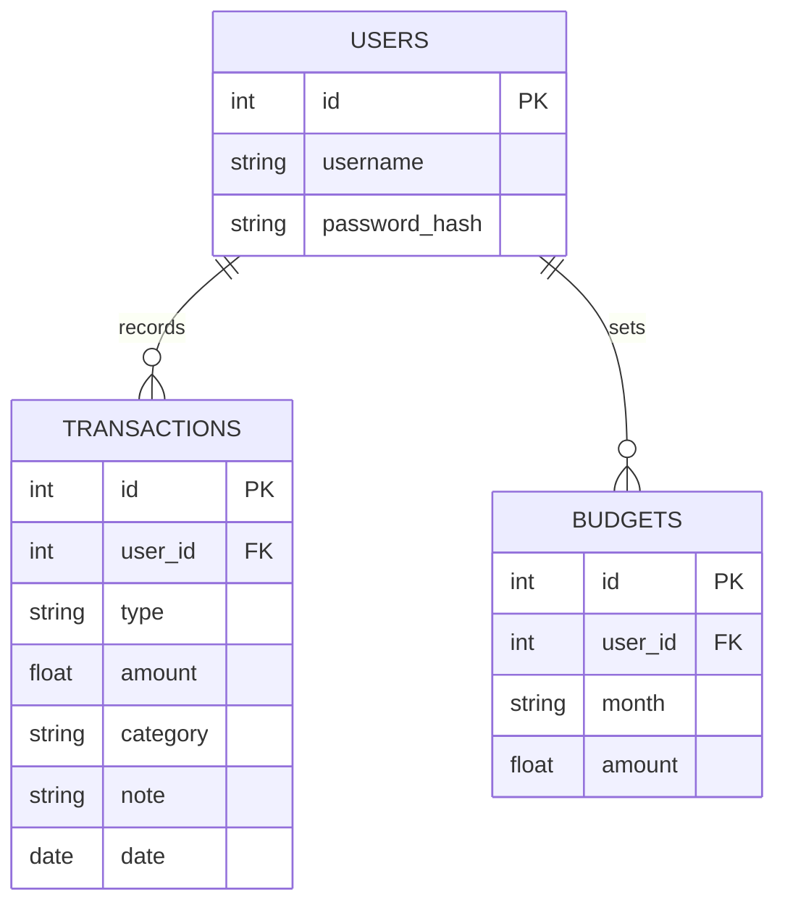

```mermaid
erDiagram
    USERS ||--o{ TRANSACTIONS : records
    USERS ||--o{ BUDGETS : sets
    USERS {
        int id PK
        string username
        string password_hash
    }
    TRANSACTIONS {
        int id PK
        int user_id FK
        string type
        float amount
        string category
        string note
        date date
    }
    BUDGETS {
        int id PK
        int user_id FK
        string month
        float amount
    }
```
