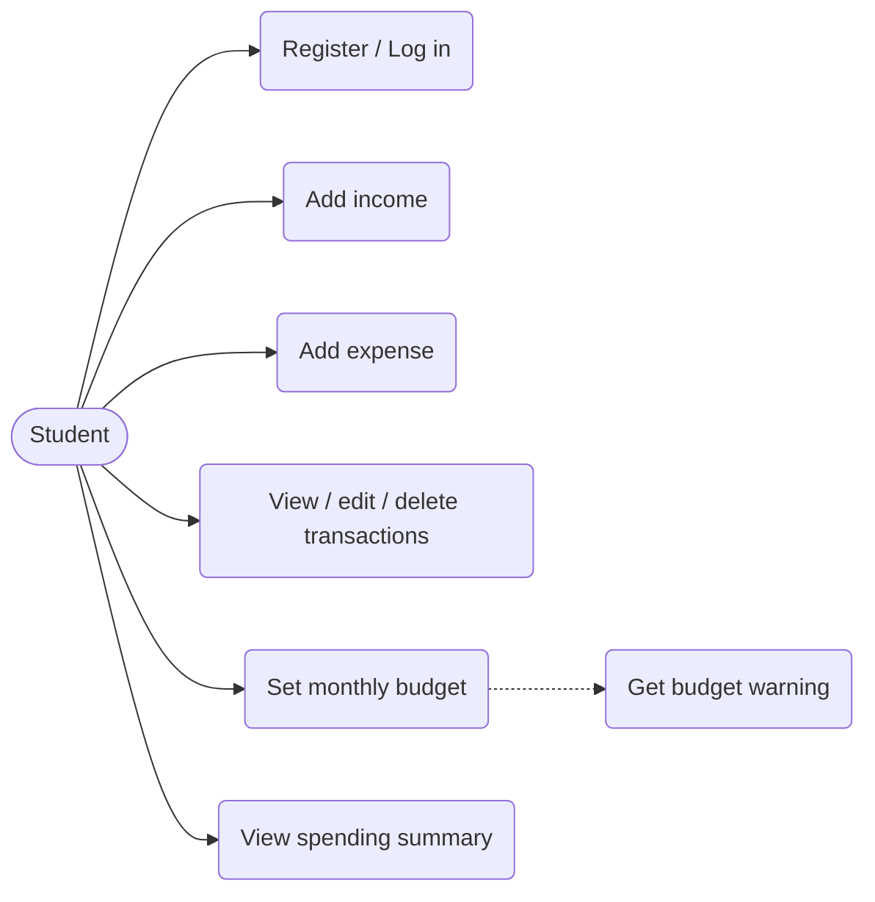

```mermaid
flowchart LR
    S([Student])
    S --> A(Register / Log in)
    S --> B(Add income)
    S --> C(Add expense)
    S --> D(View / edit / delete transactions)
    S --> E(Set monthly budget)
    S --> F(View spending summary)
    E -.-> G(Get budget warning)
```
